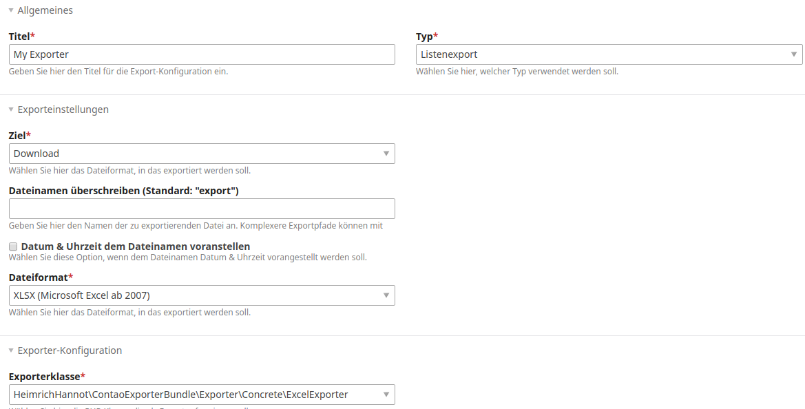

# Contao Exporter Bundle 

A module for exporting any contao entity to file.



*Export config preview*

## Features

- export entities and list of entities
- easily add backend modules to your application/extension or use the frontendmodule
- expandable exporter architecture
- included exporter:
    - csv
    - Excel (xlsx)
    - pdf
    - Media files (export media files assoziated with an entity as archive(zip))
    
Csv and Excel export are archived by [Spout library](https://github.com/box/spout).
PDF export is archived by [mPDF library](https://github.com/mpdf/mpdf). This library comes not as dependency and therefore must be added to your bundle/project dependencies to archvie pdf export functionality.

## Technical instruction

### Install 

Install with composer:

```
composer require heimrichhannot/contao-exporter-bundle
```

If you want to use the pdf exporter, add `"mpdf/mpdf":"^7.0"` to your composer dependencies.

### Backend export

#### Step 1
Define your global operation in your entity's dca as follows:

```php
'global_operations' => [
    'export_csv' => \Contao\System::getContainer()->get('huh.exporter.action.backendexport')
        ->getGlobalOperation('export_csv',$GLOBALS['TL_LANG']['MSC']['export_csv'])
],
```

#### Step 2
Add your backend module in your entity's config.php as follows:

```php
$GLOBALS['BE_MOD']['mygroup'] = [
    'export_csv' => ['huh.exporter.action.backendexport', 'export']
]
```

#### Step 3
Create a configuration for your export by using the exporter's backend module (group devtools).

### Frontend
You can use the included frontend module to add an easy export functionality. 

You can also use [frontendedit](https://github.com/heimrichhannot/contao-frontendedit) or [formhybrid_list](https://github.com/heimrichhannot/contao-formhybrid_list) in order to easily create a module for manipulating your entities in the frontend. It already contains a function to export entities after submission!

You can also create an custom implementation for your extension:

1) Create a configuration for your export by using the exporter's backend module (group devtools).
2) Call `export()` of `huh.exporter.action.frontendexport` service in your module:

```php
/** @var Symfony\Component\DependencyInjection\ContainerInterface $container */
$container->get('huh.exporter.action.export')->export($config: E
xporterModel, $entity: int|string, $fields = []: array);
```

## Developers

### Upgrade from exporter module

Please see [Upgrade Instructions](UPGRADE.md).

### Events

You can hook into the export with given event. Please check [Symfony Event Documentation](https://symfony.com/doc/3.4/event_dispatcher.html) if you don't know how. 

Eventname                 | Event-ID                              | Description
--------------------------|---------------------------------------|------------
Before Export             | huh.exporter.event.before_export      | Fired before start of export. Customize file name and file path.
Before Build Query        | huh.exporter.event.before_build_query | Fired before building and executing the query for collecting list content. 
Modify Table Header field | huh.exporter.event.modifyheaderfields | Modify header field values in tables.
Modify Table field value  | huh.exporter.event.modifyfieldvalue   | Fired before writing a table value to the table object (e.g. spreadsheet).
Modify Media File Name    | huh.exporter.event.modifymediafilename| Modify media file before adding to archive (filename and file object). 

### Add custom exporter

You can add custom exporter to add additional file types or functionality. 

Your exporter class must implement `ExporterInterface` and must be registered in the container with the `huh_exporter.exporter` service tag. We recommend to extend `AbstractExporter`, because it already has most of the mechanics implemented. 

```
services:
  _defaults:
    autowire: true

  _instanceof:
    HeimrichHannot\ContaoExporterBundle\Exporter\ExporterInterface:
      tags: ['huh_exporter.exporter']
      lazy: true
      
  Your\Exporter\Class: ~
```

### Custom field selection

You can pass an array of fields to `export()` of an exporter. Those fields will be used, when exporting an item.

There are two options:
1) A list of field names. Example: `['firstname','lastname','age']`
2) A field list with labels and values. Should be structured as shown:

```php
<?php 
$fields = [
    'field1' => [
        'raw' => '', // raw field value
        'inputType' => '', // field input type 
        'value' => '', // formatted field value
        'formatted' => '', // formatted field value
        'label' => '', // formatted field value
    ],
    // ...
];

```

### Pdf

To use Pdf export, you first need to install [mPDF][1].

#### Templates

You can overwrite the pdf output template. Templates are written in Twig and name should start with `exporter_pdf_`. See `exporter_pdf_item_default.html.twig` for a working example.

#### Fonts

To add custom Pdf font, please see the corresponding chapters in [Utils Bundle docs][3] and the [mPDF Docs][4]. Afterwards you can add the folders in the exporter config.

[1]: https://mpdf.github.io
[3]: https://github.com/heimrichhannot/contao-utils-bundle/blob/master/docs/utils/pdf/pdf_writer.md#use-custom-fonts
[4]: https://mpdf.github.io/fonts-languages/fonts-in-mpdf-7-x.html